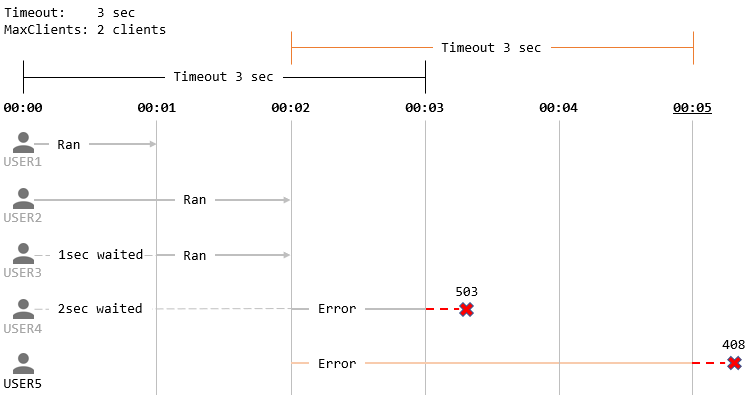

WebフレームワークのベースになるMuxライブラリ
===

```go
package main

import (
	"net/http"

	"github.com/ochipin/mux/basemux"
)

// Handler : basemux.Mux を使用するためのハンドラ
type Handler struct{}

// エラー処理
func (h *Handler) Error(err error, w http.ResponseWriter, r *http.Request) {
	if w.Header().Get("Content-Type") == "" {
		w.Header().Set("Content-Type", "text/html; charset=UTF-8")
		switch t := err.(type) {
		case *basemux.TimeoutError:
			w.WriteHeader(t.StatusCode)
		case *basemux.PanicError:
			w.WriteHeader(t.StatusCode)
		case *basemux.MaxClientsError:
			w.WriteHeader(t.StatusCode)
		}
		w.Write([]byte(err.Error()))
	}
}

// Main : リクエストを処理するエントリポイント
func (h *Handler) Main(w http.ResponseWriter, r *http.Request, refer basemux.Referer, v *basemux.Values) (basemux.Render, error) {
	return &basemux.View{
		Buffer:      []byte("HELLO WORLD"),
		ContentType: "text/html",
		StatusCode:  200,
	}, nil
}

func main() {
	// Mux を設定
	mux := &basemux.Mux{
		MaxClients: 2,          // 同時受付リクエスト数(2リクエストまで)
		Timeout:    10,         // リクエストタイムアウト(10秒間)
		MaxMemory:  32,         // アップロードファイルの処理に使用する最大使用メモリ量(32MB)
		Handler:    &Handler{}, // ハンドラを登録
	}

	// ハンドラを生成
	handler, err := mux.GenerateHandler()
	if err != nil {
		panic(err)
	}

	// サーバ起動
	serve := &http.Server{
		Addr:    ":8080",
		Handler: handler,
	}
	serve.ListenAndServe()
}
```

## MaxClients (同時受付リクエスト数) と Timeout (タイムアウト)

MaxClientsに引っかかりアクセスが不可能になった場合は503エラーとなる。  
サーバ側での処理に時間がかかり、Timeoutで設定した時間を超過した場合は、408エラーとなる。  
MaxClientsとTimeoutの関係性について説明する。

タイムアウトする時間が3秒、同時受付リクエスト数を2とし、また、登場人物はUSER1からUSER5の計5名を例に時系列に沿って説明する。

1. USER1〜USER4までのユーザが同時にアクセスしたとする。その際に、MaxClients = 2 なので、USER3, USER4 は待ちに入る。  
   
2. 1秒後、USER1の処理が終わると、MaxClientsに1つ空きができるため、待ちに入っていたUSER3の処理を開始。引き続きUSER2の処理を続行。  
  
3. 2秒経過して、USER2とUSER3の処理が完了。MaxClientsに2つ空きができるため、USER4の処理を開始。USER4の処理開始と同時にUSER5が新たにリクエストを投げた。  
  
4. USER4の処理に時間がかかり、Timeoutで設定した時間を超過してしまった場合、アクセス負荷とみなし503エラーとなる。  
503エラーになる理由は、MaxClientsに引きづられてタイムアウト時間を超過したため。   
  
5. USER5の処理に時間がかかり、Timeoutを超過してしまった場合、MaxClientsに引きづられてTimeoutした訳ではないため、408エラーとなる。  
